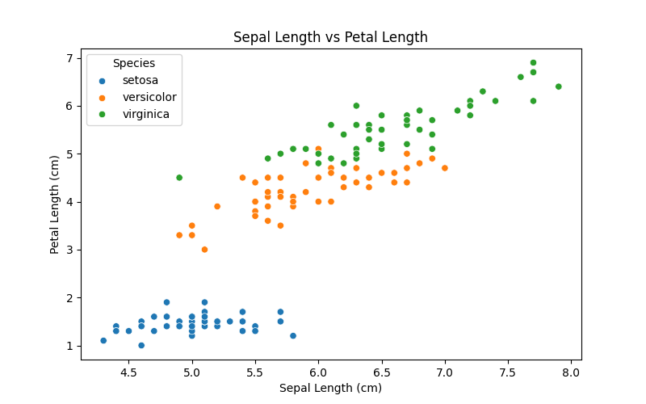

# Iris Dataset Analysis

## Project Description
This project performs exploratory data analysis on the classic Iris flower dataset, including:
- Statistical summaries
- Species comparisons
- Visualization of relationships between flower measurements

## How to Run
1. Clone the repository:
   git clone https://github.com/oluwoleowoeye/data_analysis.git

2. Install dependencies:
  pip install -r requirements.txt

3. Run the analysis:
  python iris_analysis.py

## Findings

Species Differences:
Virginica has the largest petals
Setosa has the most distinct measurements

Correlations:
Strong positive relationship (0.87) between sepal and petal length

Visual Insights:
Clear separation between species in all measurements
Linear relationship between sepal/petal length across species

##  Visualization Results

Here are the key visualizations generated by the analysis:

### 1. Sepal Length Trend

*Shows how sepal length varies across the first 50 samples*

### 2. Petal Length by Species

*Demonstrates Virginica has the longest petals on average*

### 3. Sepal vs Petal Length

*Reveals strong correlation between sepal and petal measurements*

### 4. Sepal Width Distribution

*Shows normal distribution of sepal widths across all species*